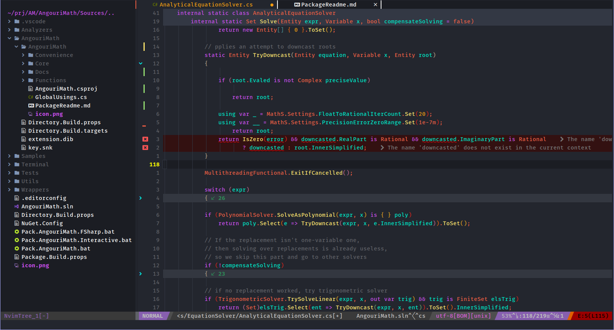

# Andromeda.nvim

[](https://img.shields.io/badge/license-MIT-green)
[](https://img.shields.io/badge/version-v0.1.1-blueviolet)

A fork of [andromeda.vim](https://github.com/safv12/andromeda.vim) adapted for neovim.

Andromeda.nvim theme supports graphical Vim and console Vim.

<p align="center">
    
</p>

## Installation
You can use your preferred Vim Package Manager to install Andromeda theme.

### Using [vim-plug](https://github.com/junegunn/vim-plug).

```vim
Plug 'WhiteBlackGoose/andromeda.nvim'
```

### Usage

```
syntax on
set background=dark
colorscheme andromeda
```

## Contribute

This is an in-progress theme. If you have any problem feel free to open an issue or create a pull request. I'll attend the issues and revisions as soon as possible.

## Licensing

The original license of andromeda.vim kept. To view WhiteBlackGoose's modifications, just run a diff.

Andromeda.nvim is licensed under the [MIT License](./LICENSE.txt).
